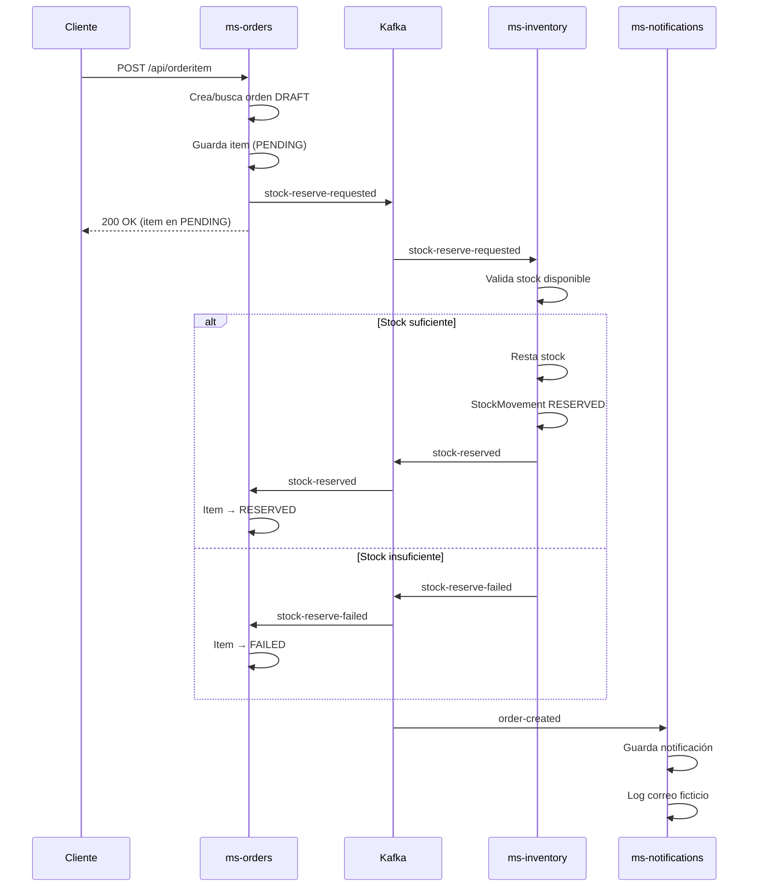
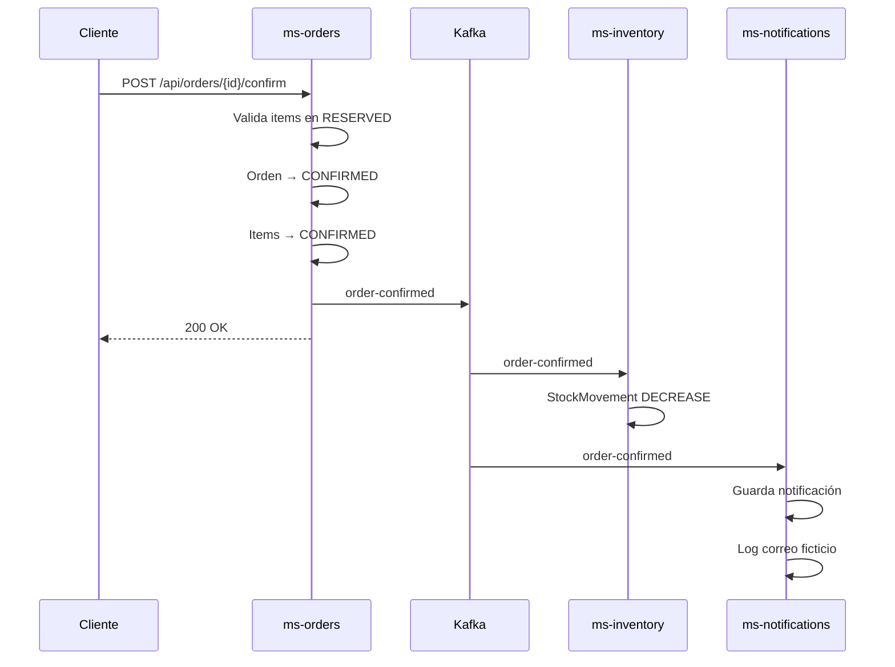
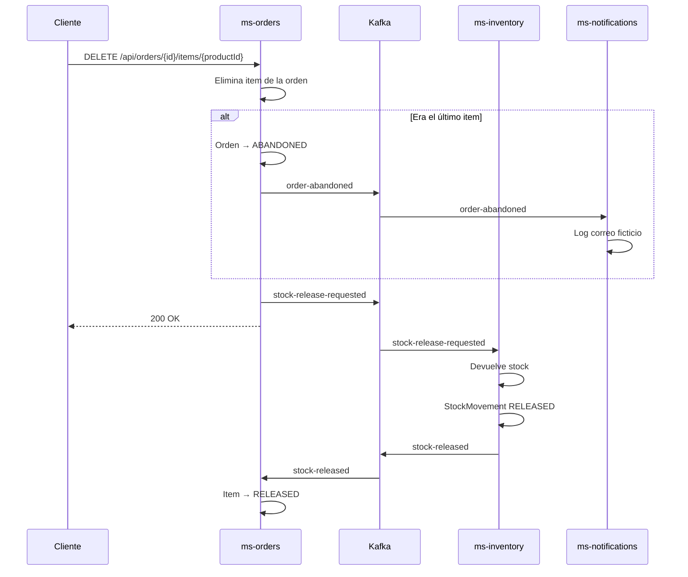

# Comunicación entre servicios

ARKA implementa el patrón **Saga coreografiada** para coordinar operaciones que involucran múltiples microservicios. No existe un orquestador central — cada servicio reacciona a los eventos que le corresponden.

## Tópicos de Kafka

| Tópico | Publicado por | Consumido por | Propósito |
|---|---|---|---|
| `stock-reserve-requested` | ms-orders | ms-inventory | Solicitar reserva de stock |
| `stock-reserved` | ms-inventory | ms-orders, ms-notifications | Confirmar reserva exitosa |
| `stock-reserve-failed` | ms-inventory | ms-orders | Notificar stock insuficiente |
| `stock-release-requested` | ms-orders | ms-inventory | Solicitar liberación de stock |
| `stock-released` | ms-inventory | ms-orders | Confirmar liberación |
| `order-created` | ms-orders | ms-notifications | Orden creada |
| `order-confirmed` | ms-orders | ms-inventory, ms-notifications | Orden confirmada |
| `order-abandoned` | ms-orders | ms-notifications | Orden abandonada |
| `order-cancelled` | ms-orders | ms-inventory, ms-notifications | Orden cancelada |

## Flujo: agregar item a una orden



## Flujo: confirmar orden



## Flujo: eliminar item



## CloudEvents

Todos los mensajes en Kafka siguen el estándar **CloudEvents**, que agrega metadata al mensaje:

```json
{
  "specversion": "1.0",
  "id": "uuid",
  "source": "https://arka.co/orders",
  "type": "stock-reserve-requested",
  "time": "2026-04-16T00:00:00Z",
  "data": {
    "orderId": 1,
    "productId": 5,
    "quantity": 2
  }
}
```

Esto permite que cualquier consumidor identifique el tipo de evento sin depender del nombre del tópico ni del formato interno.