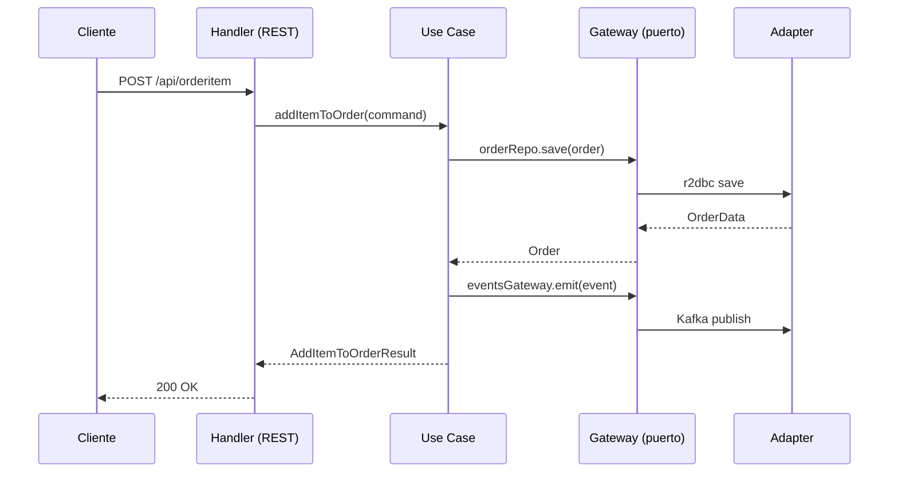

# Arquitectura Hexagonal

Cada microservicio está construido siguiendo la **arquitectura hexagonal** (también conocida como Ports & Adapters), implementada mediante el scaffold de Clean Architecture de Bancolombia.

## Estructura de módulos

ms-orders/
├── domain/
│   ├── model/          ← Entidades, value objects, gateways (puertos)
│   └── usecase/        ← Casos de uso (lógica de negocio pura)
├── infrastructure/
│   ├── driven-adapters/
│   │   ├── r2dbc-postgresql/    ← Adaptador de base de datos
│   │   └── async-event-bus/     ← Adaptador de Kafka (productor)
│   └── entry-points/
│       ├── reactive-web/        ← API REST (WebFlux)
│       └── async-event-handler/ ← Consumidor de eventos Kafka
└── applications/
└── app-service/    ← Configuración y bootstrap

## Capas y responsabilidades

### Dominio (núcleo)
Es el corazón de la aplicación. No tiene dependencias externas — solo Java puro.

- **Model** — entidades de negocio (`Order`, `OrderItem`, `Product`), value objects (`CustomerId`, `Money`, `Quantity`) y las interfaces de los gateways
- **Use cases** — implementan la lógica de negocio. Ejemplo: `AddItemToOrderUseCase`, `ReserveStockUseCase`

### Infraestructura (adaptadores)
Implementan los puertos definidos en el dominio.

- **r2dbc-postgresql** — implementa los repositorios usando Spring Data R2DBC
- **async-event-bus** — implementa `EventsGateway` usando Reactive Commons + Kafka
- **reactive-web** — expone los endpoints REST con Spring WebFlux
- **async-event-handler** — registra los listeners de eventos Kafka

## Flujo de una petición

## Beneficios aplicados

**Independencia del framework** — los casos de uso no importan Spring. Si mañana cambias de WebFlux a MVC, el dominio no cambia.

**Testabilidad** — los casos de uso se pueden probar con mocks de los gateways sin levantar base de datos ni Kafka.

**Separación clara** — un nuevo desarrollador sabe exactamente dónde está la lógica de negocio y dónde están los detalles técnicos.