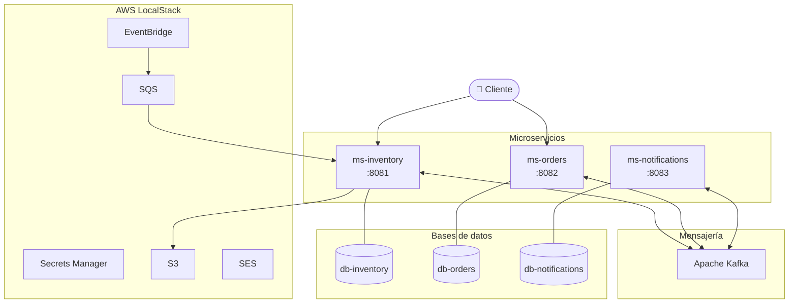

# Vista general del sistema

ARKA está construido sobre una arquitectura de microservicios donde cada servicio es independiente, tiene su propia base de datos y se comunica de forma asíncrona a través de Apache Kafka.

## Diagrama general

## Principios de diseño

**Database per Service** — cada microservicio tiene su propia base de datos PostgreSQL. Ningún servicio accede directamente a la base de datos de otro.

**Event-driven architecture** — los servicios no se llaman directamente entre sí. Se comunican publicando y consumiendo eventos en Kafka.

**Reactive programming** — todos los servicios usan Spring WebFlux con R2DBC para operaciones no bloqueantes.

**Infrastructure as Code** — toda la infraestructura AWS está definida en CloudFormation y se despliega automáticamente con LocalStack.

## Puertos y servicios

| Servicio | Puerto | Base de datos |
|---|---|---|
| ms-inventory | 8081 | db-inventory:5431 |
| ms-orders | 8082 | db-orders:5433 |
| ms-notifications | 8083 | db-notifications:5434 |
| Kafka | 9092 | — |
| Kafka UI | 8080 | — |
| LocalStack | 4566 | — |