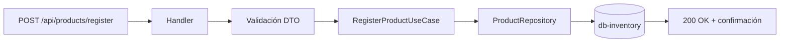

# HU1 — Registro de productos

**Como** administrador,  
**quiero** registrar productos en el sistema,  
**para** tener un catálogo disponible para los clientes.

## Criterios de aceptación

- El producto debe tener nombre, descripción, precio, stock y categoría
- Los campos nombre, precio, stock y categoría son requeridos
- El precio debe ser mayor a cero
- El stock no puede ser negativo
- El sistema retorna un mensaje de confirmación al registrar exitosamente

## Implementación

El registro se realiza a través del endpoint `POST /api/products/register` en **ms-inventory**.

### Endpoint

```http
POST http://localhost:8081/api/products/register
Content-Type: application/json

{
  "name": "iPhone 15 Pro",
  "description": "Smartphone Apple con chip A17 Pro",
  "price": 4500000.00,
  "stock": 15,
  "category": "SMARTPHONE"
}
```

### Respuesta exitosa

```json
{
  "id": 1,
  "name": "iPhone 15 Pro",
  "message": "Product registered successfully"
}
```

### Validación de campos requeridos

La validación se implementó en el constructor del record DTO, aprovechando que Java lanza `IllegalArgumentException` automáticamente al deserializar:

```java
public record RegisterProductRequestDTO(
        String name,
        String description,
        BigDecimal price,
        Integer stock,
        String category
) {
    public RegisterProductRequestDTO {
        if (name == null || name.isBlank())
            throw new IllegalArgumentException("name must not be blank");
        if (price == null || price.compareTo(BigDecimal.ZERO) <= 0)
            throw new IllegalArgumentException("price must be positive");
        if (stock == null || stock < 0)
            throw new IllegalArgumentException("stock must be >= 0");
        if (category == null || category.isBlank())
            throw new IllegalArgumentException("category must not be blank");
    }
}
```

### Respuesta cuando falta un campo requerido

```json
{
  "status": 400,
  "error": "BAD_REQUEST",
  "message": "name must not be blank"
}
```

## Flujo simplificado



## Categorías disponibles

Las categorías son un enum en el dominio que garantiza valores válidos:

```java
public enum Category {
    SMARTPHONE,
    LAPTOP,
    AUDIO,
    MONITOR,
    ACCESSORIES,
    ELECTRONICS
}
```