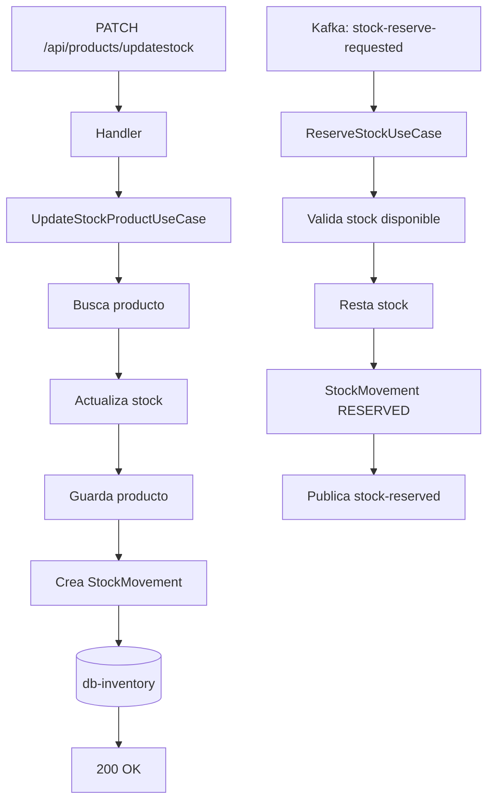

# HU2 — Actualización de stock

**Como** administrador,  
**quiero** actualizar la cantidad de stock de un producto,  
**para** mantener el inventario al día.

## Criterios de aceptación

- No se permiten valores negativos de stock
- Se registra un historial de cada cambio en el stock
- El historial indica stock anterior, stock nuevo y delta de cambio

## Implementación

El stock se actualiza de dos maneras en el sistema:

### 1. Manual — endpoint directo

```http
PATCH http://localhost:8081/api/products/updatestock
Content-Type: application/json

{
  "productId": 1,
  "newStock": 25,
  "reason": "Reabastecimiento de inventario"
}
```

### 2. Automática — via eventos Kafka

El stock también se actualiza automáticamente cuando ocurren eventos de órdenes:

| Evento | Acción en stock | Tipo de movimiento |
|---|---|---|
| `stock-reserve-requested` | Resta la cantidad reservada | `RESERVED` |
| `stock-release-requested` | Devuelve la cantidad liberada | `RELEASED` |
| `order-confirmed` | Registra el descuento definitivo | `DECREASE` |
| `order-cancelled` | Devuelve stock de items reservados | `RELEASED` |

## Historial de cambios — Stock Movements

Cada cambio en el stock genera un registro en la tabla `stock_movements`:

```sql
CREATE TABLE stock_movements (
    id           SERIAL PRIMARY KEY,
    product_id   INTEGER NOT NULL,
    previous_stock INTEGER NOT NULL,
    new_stock    INTEGER NOT NULL,
    delta        INTEGER NOT NULL,
    reason       VARCHAR(255),
    type         VARCHAR(30) NOT NULL,
    created_at   TIMESTAMP NOT NULL
);
```

### Tipos de movimiento

```java
public enum StockMovementType {
    INCREASE,    // stock aumentó manualmente
    DECREASE,    // stock disminuyó manualmente
    ADJUSTMENT,  // ajuste sin cambio neto
    RESERVED,    // stock congelado por orden pendiente
    RELEASED     // stock liberado por cancelación
}
```

### Ejemplo de registro

| Campo | Valor |
|---|---|
| product_id | 1 |
| previous_stock | 15 |
| new_stock | 12 |
| delta | -3 |
| reason | Stock reserved for order: 5 |
| type | RESERVED |

## Validación de valores negativos

```java
public record UpdateStockProductRequestDTO(
        Integer productId,
        Integer newStock,
        String reason
) {
    public UpdateStockProductRequestDTO {
        if (productId == null)
            throw new IllegalArgumentException("productId is required");
        if (newStock == null || newStock < 0)
            throw new IllegalArgumentException("stock must be >= 0");
    }
}
```

## Flujo completo

