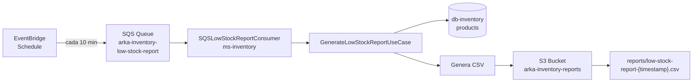

# HU3 — Reporte de bajo stock

**Como** administrador,  
**quiero** obtener un reporte de productos con bajo stock,  
**para** tomar decisiones de abastecimiento a tiempo.

## Criterios de aceptación

- El umbral de bajo stock es configurable
- El reporte se genera automáticamente cada cierto tiempo
- El reporte también se puede generar manualmente
- Se exporta en formato CSV
- El archivo se almacena en S3

## Implementación

### Generación manual

```http
GET http://localhost:8081/api/products/low-stock-report?threshold=10
```

### Generación automática — flujo completo

El reporte se genera automáticamente mediante una integración entre **EventBridge**, **SQS** y **ms-inventory**:



### Configuración del umbral

El umbral se configura en el `application.yaml` de ms-inventory:

```yaml
inventory:
  stock:
    low-threshold: 10
```

### Infraestructura AWS (LocalStack)

La regla de EventBridge está definida en CloudFormation:

```yaml
rLowStockReportRule:
  Type: AWS::Events::Rule
  Properties:
    Name: arka-low-stock-report-rule
    ScheduleExpression: "rate(10 minutes)"
    State: ENABLED
    Targets:
      - Id: low-stock-target
        Arn: !GetAtt rLowStockReportQueue.Arn
```

### Ejemplo de CSV generado

```csv
id,name,stock,category,price
2,MacBook Air M3,3,LAPTOP,6800000.00
4,Samsung Galaxy S24,5,SMARTPHONE,3800000.00
```

### Archivo en S3

reports/low-stock-report-2026-04-20 00_29_39.csv

## Componentes clave

| Componente | Tecnología | Responsabilidad |
|---|---|---|
| EventBridge | AWS | Disparar evento cada X minutos |
| SQS | AWS | Cola de mensajes |
| SQSLowStockReportConsumer | Spring | Escuchar la cola |
| GenerateLowStockReportUseCase | Java | Generar el CSV |
| S3Adapter | AWS SDK | Subir el archivo a S3 |

## Umbral configurable por environment

Esto permite tener diferentes umbrales por ambiente sin cambiar código:

dev:   low-threshold: 10
stage: low-threshold: 50
prod:  low-threshold: 100