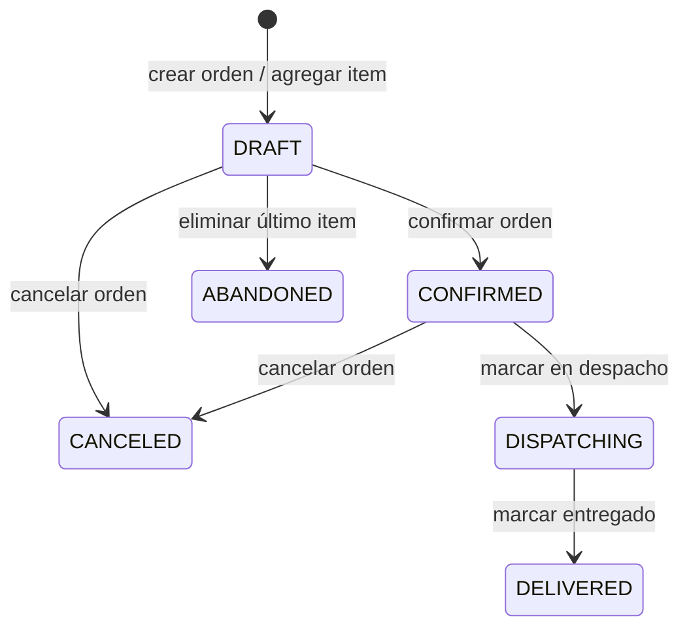
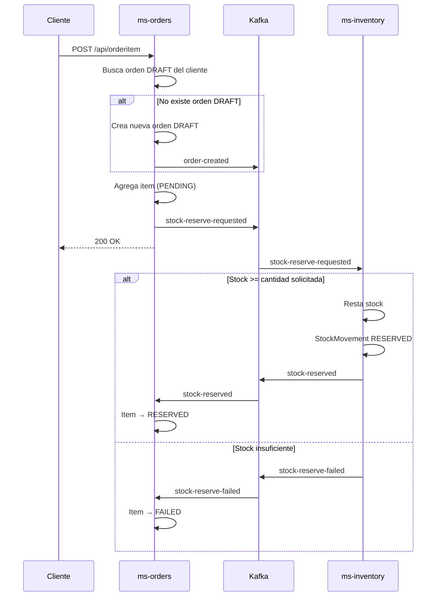

# HU4 — Orden de compra

**Como** usuario,  
**quiero** registrar una orden de compra con múltiples productos,  
**para** gestionar mis compras en la plataforma.

## Criterios de aceptación

- Se verifica disponibilidad de stock antes de confirmar
- Se registra fecha y detalle del pedido
- El sistema retorna confirmación con resumen del pedido
- Si no hay stock suficiente el item queda en estado `FAILED`

## Estados de la orden



## Estados del item

| Estado | Descripción |
|---|---|
| `PENDING` | Item recién agregado, esperando respuesta de inventory |
| `RESERVED` | Stock reservado exitosamente |
| `FAILED` | No había stock suficiente |
| `CONFIRMED` | Orden confirmada, stock descontado definitivamente |
| `RELEASED` | Stock liberado por eliminación del item |
| `CANCELLED` | Item cancelado junto con la orden |

## Endpoints

### Agregar item a la orden

```http
POST http://localhost:8082/api/orderitem
Content-Type: application/json

{
  "customerId": 1,
  "productId": 2,
  "quantity": 3,
  "unitPrice": 6800000.00
}
```

Si no existe una orden en estado `DRAFT` para ese cliente, se crea automáticamente.

Si el producto ya existe en la orden, se suma la cantidad.

### Respuesta

```json
{
  "customerId": 1,
  "orderId": 5,
  "productId": 2,
  "quantity": 3,
  "message": "Product added to order"
}
```

### Consultar orden con items y total

```http
GET http://localhost:8082/api/orders/{orderId}
```

```json
{
  "orderId": 5,
  "customerId": 1,
  "status": "DRAFT",
  "createdAt": "2026-04-20T10:00:00",
  "items": [
    {
      "productId": 2,
      "quantity": 3,
      "unitPrice": 6800000.00,
      "lineTotal": 20400000.00,
      "status": "RESERVED"
    }
  ],
  "total": 20400000.00
}
```

## Flujo completo



## Verificación de disponibilidad

La verificación ocurre en **ms-inventory** de forma asíncrona:

```java
public Mono<Void> execute(StockReserveRequestedEvent event) {
    return productRepository.findById(event.productId())
            .flatMap(product -> {
                if (product.getStock() < event.quantity()) {
                    return eventsGateway.emit(
                            StockReserveFailedEvent.TOPIC,
                            new StockReserveFailedEvent(
                                    event.orderId(),
                                    event.productId(),
                                    event.quantity(),
                                    "Insufficient stock for product: " + event.productId()
                            )
                    );
                }
                // reserva el stock...
            });
}
```

## Total de la orden

El total solo suma items en estado `RESERVED` o `CONFIRMED`:

```java
public Money total() {
    BigDecimal sum = items.stream()
            .filter(item -> item.getStatus() == OrderItemStatus.RESERVED
                    || item.getStatus() == OrderItemStatus.CONFIRMED)
            .map(OrderItem::lineTotal)
            .reduce(BigDecimal.ZERO, BigDecimal::add);
    return new Money(sum);
}
```