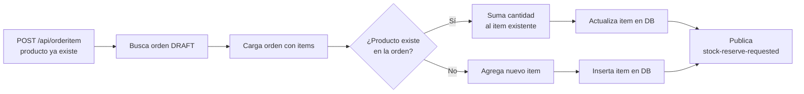
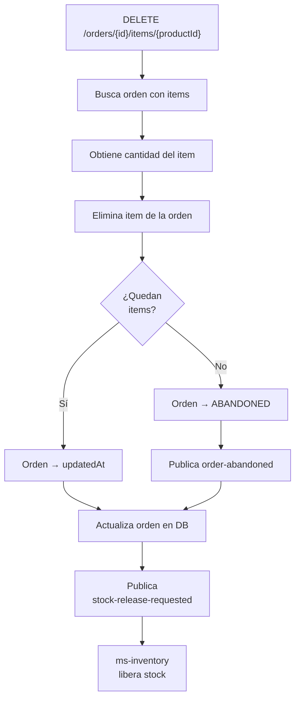

# HU5 — Modificar orden antes de confirmación

**Como** usuario,  
**quiero** modificar mi pedido antes de confirmarlo,  
**para** corregir errores o ajustar cantidades.

## Criterios de aceptación

- Solo se pueden modificar pedidos en estado `DRAFT`
- Se puede agregar un producto nuevo a la orden
- Si el producto ya existe, se suma la cantidad
- Se puede eliminar un producto de la orden
- Al eliminar el último item, la orden pasa a `ABANDONED`
- Al eliminar un item se libera el stock reservado

## Estado actual de la implementación

:::info Nota importante
El sistema crea automáticamente una orden en estado `DRAFT` cuando se agrega el primer item. Por diseño, no es posible agregar items a una orden en un estado diferente a `DRAFT` — el sistema siempre busca o crea una orden draft para el cliente.
:::

## Endpoints disponibles

### Agregar producto a la orden existente

Si el producto ya existe en la orden, se actualiza la cantidad sumando:

```http
POST http://localhost:8082/api/orderitem
Content-Type: application/json

{
  "customerId": 1,
  "productId": 2,
  "quantity": 2,
  "unitPrice": 6800000.00
}
```

### Eliminar producto de la orden

```http
DELETE http://localhost:8082/api/orders/{orderId}/items/{productId}
```

### Respuesta al eliminar

```json
{
  "orderId": 5,
  "productId": 2,
  "quantity": 3,
  "message": "Item removed from order"
}
```

Si era el último item:

```json
{
  "orderId": 5,
  "productId": 2,
  "quantity": 3,
  "message": "Order abandoned - no items remaining"
}
```

## Flujo al agregar un producto ya existente



## Flujo al eliminar un item



## Validación de estado DRAFT

La validación está en el dominio — el método `removeItem` llama `validateStatus()`:

```java
private void validateStatus() {
    if (status != OrderStatus.DRAFT)
        throw new ResourceNotFoundException(
            "Only DRAFT orders can be modified"
        );
}

public void removeItem(ProductId productId) {
    validateStatus();
    items.removeIf(item -> 
        item.getProductId().value().equals(productId.value())
    );
    this.touch();
}
```

## Liberación de stock al eliminar

Cuando se elimina un item ms-inventory recibe el evento y devuelve el stock:

```java
public Mono<Void> execute(StockReleaseRequestedEvent event) {
    return productRepository.findById(event.productId())
            .flatMap(product -> {
                int previousStock = product.getStock();
                product.updateStockBy(event.quantity()); // suma de vuelta
                return productRepository.save(product)
                        .flatMap(savedProduct -> {
                            StockMovement movement = StockMovement.createReleased(
                                    savedProduct.getId(),
                                    previousStock,
                                    savedProduct.getStock(),
                                    event.orderId(),
                                    LocalDateTime.now()
                            );
                            return stockMovementRepository.save(movement);
                        });
            })
            .then();
}
```