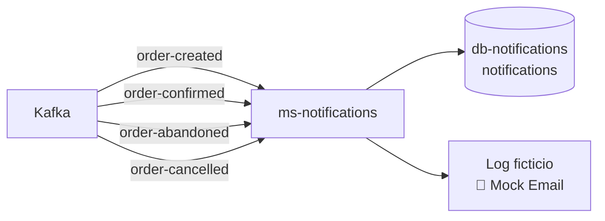
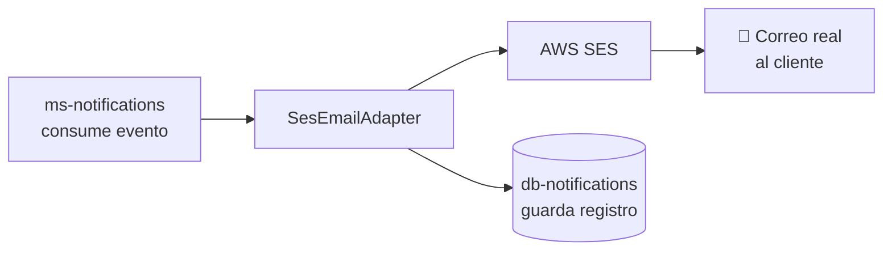
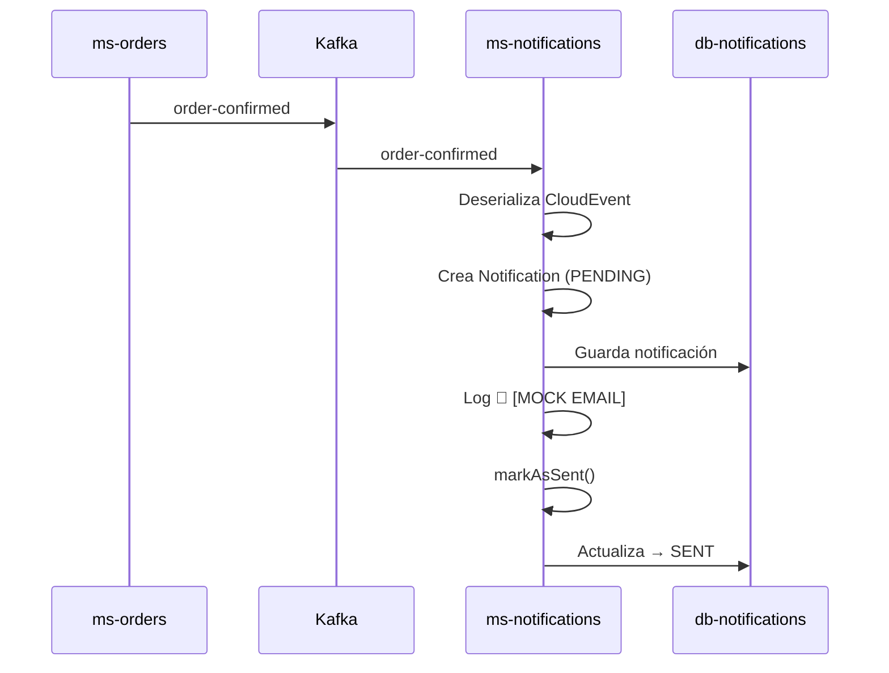

# HU6 — Notificaciones al cliente

**Como** usuario,  
**quiero** recibir notificaciones sobre los cambios de estado de mi pedido,  
**para** estar informado del progreso de mi compra.

## Criterios de aceptación

- Notificar cuando la orden es creada
- Notificar cuando la orden es confirmada
- Notificar cuando la orden es abandonada
- Notificar cuando la orden es cancelada
- Guardar registro de cada notificación enviada

## Implementación actual

Se implementó un microservicio dedicado **ms-notifications** que consume eventos de Kafka y registra las notificaciones en base de datos. El envío de correo real está preparado pero pendiente de un dominio de correo verificado.

## Arquitectura de ms-notifications



## Eventos consumidos

| Evento Kafka | Tipo de notificación | Asunto del correo |
|---|---|---|
| `order-created` | `ORDER_CREATED` | Orden #X creada exitosamente |
| `order-confirmed` | `ORDER_CONFIRMED` | Orden #X confirmada |
| `order-abandoned` | `ORDER_ABANDONED` | Orden #X abandonada |
| `order-cancelled` | `ORDER_CANCELLED` | Orden #X cancelada |

## Tabla de notificaciones

```sql
CREATE TABLE notifications (
    id          SERIAL PRIMARY KEY,
    order_id    INTEGER NOT NULL,
    customer_id INTEGER NOT NULL,
    type        VARCHAR(50) NOT NULL,
    status      VARCHAR(20) NOT NULL,
    recipient   VARCHAR(255) NOT NULL,
    subject     VARCHAR(255) NOT NULL,
    body        TEXT NOT NULL,
    created_at  TIMESTAMP NOT NULL DEFAULT NOW()
);
```

## Estados de una notificación

```java
public enum NotificationStatus {
    PENDING,  // recién creada
    SENT,     // enviada exitosamente
    FAILED    // falló el envío
}
```

## Log ficticio de correo

Durante la POC el correo se simula con un log:

📧 [MOCK EMAIL] To: test@arka.co
Subject: Orden #5 confirmada
Body: Tu orden #5 ha sido confirmada exitosamente.

## Mejoras planificadas — Envío real con SES

El adaptador de SES ya está diseñado. Para activarlo se necesita:

1. **Dominio de correo verificado** en AWS SES
2. **Salir del sandbox** de SES (solicitud a AWS)
3. **Activar el servicio SES** en LocalStack Pro



### Código del adaptador SES preparado

```java
public Mono<Boolean> send(Notification notification) {
    SendEmailRequest request = SendEmailRequest.builder()
            .source(sender)
            .destination(Destination.builder()
                    .toAddresses(notification.getRecipient())
                    .build())
            .message(Message.builder()
                    .subject(Content.builder()
                            .data(notification.getSubject())
                            .build())
                    .body(Body.builder()
                            .text(Content.builder()
                                    .data(notification.getBody())
                                    .build())
                            .build())
                    .build())
            .build();

    return Mono.fromFuture(sesAsyncClient.sendEmail(request))
            .thenReturn(true)
            .onErrorReturn(false);
}
```

## Flujo completo al confirmar una orden

