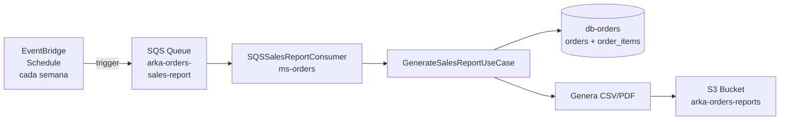

# HU7 — Reporte de ventas semanales

**Como** administrador,  
**quiero** generar reportes de ventas semanales,  
**para** analizar el rendimiento del negocio.

## Criterios de aceptación

- Total de ventas del período
- Productos más vendidos
- Clientes más frecuentes
- Exportar en formato CSV o PDF

## Estado de implementación

:::caution No implementado
Esta historia de usuario no fue implementada en el sprint actual. Sin embargo, la arquitectura del sistema permite su implementación siguiendo exactamente el mismo patrón usado en **HU3 — Reporte de bajo stock**.
:::

## Cómo se implementaría

El flujo sería idéntico al reporte de bajo stock, aprovechando la infraestructura ya existente:



## Componentes a implementar

### 1. En ms-orders

**`GenerateSalesReportUseCase`** — consulta órdenes confirmadas en el período:

```java
public Mono<String> generateReport(LocalDateTime from, LocalDateTime to) {
    return orderRepository.findConfirmedBetween(from, to)
            .flatMap(orders -> {
                // calcular totales
                // productos más vendidos
                // clientes más frecuentes
                // generar CSV
            });
}
```

**`SQSSalesReportConsumer`** — escucha la cola SQS:

```java
@Scheduled
public void consumeMessage() {
    // recibe mensaje de SQS
    // ejecuta GenerateSalesReportUseCase
    // elimina mensaje de la cola
}
```

### 2. En LocalStack — infra.yaml

```yaml
rSalesReportQueue:
  Type: AWS::SQS::Queue
  Properties:
    QueueName: arka-orders-sales-report

rSalesReportRule:
  Type: AWS::Events::Rule
  Properties:
    ScheduleExpression: "rate(7 days)"
    Targets:
      - Id: sales-report-target
        Arn: !GetAtt rSalesReportQueue.Arn
```

### 3. Estructura del reporte CSV

```csv
periodo,total_ventas,total_ordenes
2026-04-01/2026-04-07,125400000.00,15

producto_id,nombre,unidades_vendidas,total_generado
1,iPhone 15 Pro,8,36000000.00
2,MacBook Air M3,3,20400000.00

cliente_id,total_ordenes,total_gastado
1,3,45000000.00
5,2,28000000.00
```

## Por qué no se implementó

El tiempo del sprint se priorizó en:

1. La Saga coreografiada con Kafka (HU4, HU5)
2. El sistema de notificaciones (HU6)
3. La infraestructura base de los tres microservicios

Esta HU tiene menor complejidad técnica que las anteriores ya que reutiliza patrones ya implementados, por lo que sería la primera en el siguiente sprint.