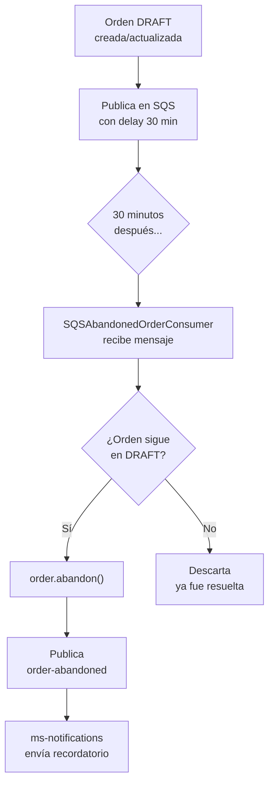
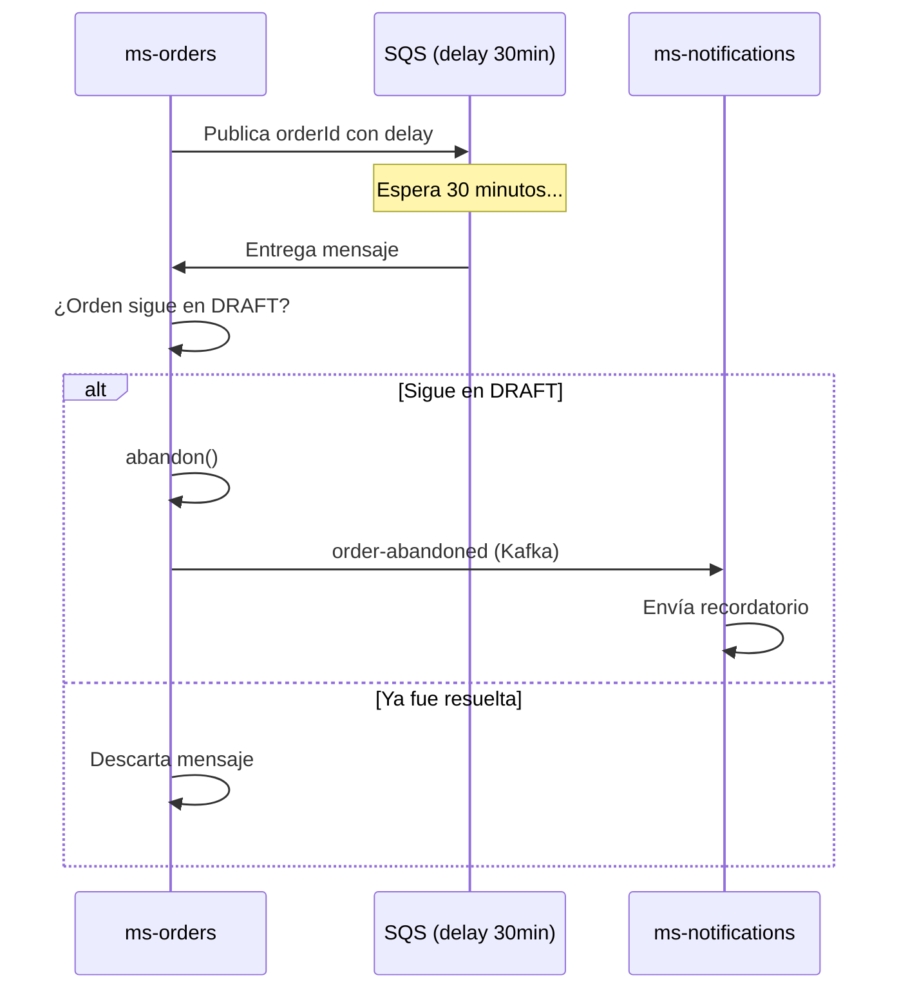

# HU8 — Carritos abandonados

**Como** administrador,  
**quiero** visualizar carritos abandonados y contactar a los clientes,  
**para** recuperar ventas perdidas.

## Criterios de aceptación

- Identificar órdenes abandonadas por tiempo de inactividad
- Identificar el tiempo que duró la orden activa
- Enviar recordatorio por correo al cliente

## Estado de implementación

:::caution No implementado
Esta historia de usuario no fue implementada en el sprint actual. Sin embargo, se diseñó la solución técnica considerando eficiencia y escalabilidad.
:::

## Tipos de abandono identificados

El sistema ya maneja dos tipos de abandono:

### 1. Abandono explícito — ya implementado
Ocurre cuando el cliente elimina el último item de su orden:

Cliente elimina último item
↓
order.abandon() → status = ABANDONED
↓
Publica order-abandoned en Kafka
↓
ms-notifications envía correo

### 2. Abandono por timeout — pendiente
Ocurre cuando una orden lleva X tiempo sin actualizarse:

Orden DRAFT sin actividad > 30 minutos
↓
Sistema detecta inactividad
↓
order.abandon() → status = ABANDONED
↓
Publica order-abandoned en Kafka
↓
ms-notifications envía recordatorio

## Solución técnica propuesta

### Por qué NO usar polling masivo

Consultar toda la tabla de órdenes cada X minutos en una base de datos grande consumiría muchos recursos innecesariamente — especialmente si la mayoría de órdenes ya están resueltas.

### Solución: SQS con delay

Cuando se crea o actualiza una orden, se publica un mensaje en SQS con un **delay de X minutos**. Cuando el mensaje llega, el sistema solo verifica esa orden específica:



### Ventajas de este enfoque

- **Sin polling masivo** — solo se verifica la orden específica
- **Escalable** — cada orden tiene su propio mensaje con su propio delay
- **Preciso** — el delay se reinicia cada vez que la orden se actualiza
- **Sin falsos positivos** — si la orden fue confirmada o cancelada antes del delay, se descarta

## Componentes a implementar

### En ms-orders

**`AbandonOrderUseCase`**:
```java
public Mono<Void> checkAndAbandon(Integer orderId) {
    return orderRepository.findById(orderId)
            .filter(order -> order.getStatus() == OrderStatus.DRAFT)
            .flatMap(order -> {
                order.abandon();
                return orderRepository.saveOrderOnly(order)
                        .then(eventsGateway.emit(
                                OrderAbandonedEvent.TOPIC,
                                new OrderAbandonedEvent(
                                        order.getId(),
                                        order.getCustomerId().value()
                                )
                        ));
            });
}
```

**`SQSAbandonedOrderConsumer`** — escucha la cola con delay:
```java
public void consumeMessage(String orderId) {
    abandonOrderUseCase.checkAndAbandon(Integer.parseInt(orderId))
            .subscribe();
}
```

### En LocalStack — infra.yaml

```yaml
rAbandonedOrderQueue:
  Type: AWS::SQS::Queue
  Properties:
    QueueName: arka-orders-abandoned-check
    MessageRetentionPeriod: 3600

rAbandonedOrderQueuePolicy:
  Type: AWS::SQS::QueuePolicy
  Properties:
    Queues:
      - !Ref rAbandonedOrderQueue
```

### Flujo completo con recordatorio



## Reporte de carritos abandonados

Adicionalmente se podría exponer un endpoint para visualizar:

```http
GET http://localhost:8082/api/orders/abandoned?from=2026-04-01&to=2026-04-21
```

```json
[
  {
    "orderId": 3,
    "customerId": 5,
    "createdAt": "2026-04-20T10:00:00",
    "abandonedAt": "2026-04-20T10:35:00",
    "minutesActive": 35,
    "itemCount": 2,
    "totalEstimated": 11300000.00
  }
]
```